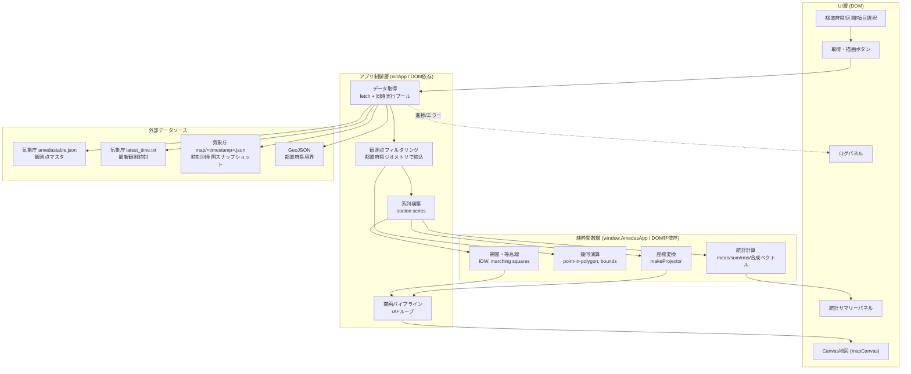

# 設計書 — アメダス都道府県統計ビューア

対象: `index.html`（単一ファイル構成の Web アプリ）
関連: [`要件.txt`](./要件.txt) / [`追加要件.txt`](./追加要件.txt) / [`skil.md`](./skil.md)（開発プロセス定義）

> 本書は初版作成後、[`追加要件.txt`](./追加要件.txt)（①離島の地域分離、②ヒートマップの県境外描画、③統計区間を1時間/24時間に変更）を反映して更新している。追加分の詳細は §5.2〜§5.4、§9（追補）を参照。

---

## 1. 要件の構造化

### 機能要件
- 都道府県を選択すると、その都道府県内のアメダス観測点の統計量を計算する。
  - 降水量：累計値・平均値
  - 気温：平均値
  - 湿度：平均値
  - 風：合成ベクトル平均（u,v成分合成）／RMS（二乗平均平方根）
- 統計区間として 1時間 / 24時間 を選択できる（[`追加要件.txt`](./追加要件.txt) により当初の「24h/1か月/1年」から変更）。
- 地図上に観測点位置・ヒートマップ・等高線・都道府県境界を重畳表示する。
- 描画項目（降水量・気温・湿度・風速・風向）を切り替えられる。
- 各レイヤーの表示可否をチェックボックスで切り替えられる。
- 本土から離れた離島（例：東京都の小笠原諸島）は本土とは別の「地域」として切り替えて表示できる（追加要件①、§5.2）。
- ヒートマップは都道府県境界の内側だけでなく、境界の外側にもなめらかに（近傍観測点を用いて）描画される（追加要件②、§5.3）。

### 非機能要件
- 外部ライブラリ非依存（GeoJSON 取得の fetch のみ許可）。
- 単一 HTML ファイルで完結（データ取得・統計計算・描画）。
- 描画は `requestAnimationFrame` によるスムーズな更新。

### 制約条件
- データソースは気象庁アメダス公開 API または CSV（過去データ）。
- 等高線は IDW 等の簡易補間を自前実装してよい。

### 入出力仕様
- 入力: 都道府県（UI選択）、統計区間（UI選択）、描画項目（UI選択）、レイヤー表示切替（チェックボックス）。
- 出力: 統計サマリー（数値テーブル）、地図描画（Canvas）、ログパネル、エラー通知。

### 想定ユーザー
- 気象データに関心のある一般ユーザー／技術者。ブラウザで `index.html` を開くだけで利用できることを想定。

### 実行環境
- モダンブラウザ（Canvas2D, fetch, Promise, ES5〜ES2015 相当の JS が動作する環境）。
- インターネット接続必須（気象庁 API と GeoJSON を実行時に fetch するため）。

---

## 2. 全体アーキテクチャ

単一 HTML ファイル内に、責務ごとに以下の3層で構成する。



- **純粋関数層 (`window.AmedasApp`)**: DOM・fetch に依存しない計算・幾何・補間ロジック。テスト対象。
- **アプリ制御層 (`initApp`)**: DOM 要素の取得、イベントハンドリング、fetch 呼び出し、描画ループの起動。`document` が存在する環境でのみ実行される（`typeof document !== "undefined"` でガード）ため、Node.js のテスト実行時には副作用を持たない。
- **UI層**: `index.html` 内の DOM 要素とスタイル。

---

## 3. モジュール構成（`index.html` 内セクション）

| セクション | 内容 |
|---|---|
| 1. 定数 | 都道府県名リスト、気象庁APIエンドポイント、描画項目メタ情報 |
| 2. 純粋関数群（`AmedasApp`） | 単位変換、統計計算、幾何判定、IDW補間、等高線生成、座標変換、色変換、時刻整形 |
| 3. アプリ本体（`initApp`） | DOM初期化、データ取得オーケストレーション、描画、インタラクション（ドラッグ/ホイールズーム/ホバー） |

### 3.1 純粋関数一覧（`window.AmedasApp`）
| 関数 | 役割 |
|---|---|
| `dmsToDecimal` | 度分表記 → 10進度 |
| `windDirCodeToDeg` / `degToCompass16` | JMA風向コード(0-16) ↔ 角度 ↔ 16方位名 |
| `meanOf` / `sumOf` / `rmsOf` | 数値配列の平均・合計・RMS（非数値は無視） |
| `vectorWindAverage` | 風の合成ベクトル平均（u,v成分合成、気象学的"from"規約） |
| `pointInRing` / `pointInPolygonCoords` / `pointInGeometry` | Ray-casting法による点-多角形包含判定（穴・MultiPolygon対応） |
| `geometryBounds` / `polygonBounds` | GeoJSONジオメトリ／単一ポリゴンの外接矩形（bbox） |
| `bboxGapDistance` | 2つの外接矩形どうしの隙間距離（重なっていれば0） |
| `clusterPolygons` | MultiPolygonを地理的近接度でクラスタリング（本土・離島の地域分離、Union-Find、§5.2） |
| `distPointToSegmentSq` | 点と線分の最短距離の2乗 |
| `pointNearGeometry` | 点がジオメトリ内部、または境界からバッファ距離以内にあるか（県境外へのヒートマップ描画に使用、§5.3） |
| `makeProjector` | 経緯度 → キャンバス座標への等縮尺投影（簡易平面近似、緯度補正付き） |
| `idwGrid` | 逆距離加重法（IDW）によるグリッド補間 |
| `maskGridByGeometry` | グリッドをジオメトリ外（オプションでバッファ距離考慮）でNaNマスク |
| `marchingSquaresContours` | 簡易マーチングスクエア法による等高線セグメント生成 |
| `linspace` | 等間隔数列生成（等高線レベル決定に使用） |
| `valueToColorHsl` | 値 → HSLグラデーション色（未使用箇所を除き主にレガシー、実描画は`hslToRgb`経由のビットマップ生成を使用） |
| `formatJstTimestamp` / `buildTimestamps` | JST時刻文字列整形、直近N点分（任意の分刻み間隔）のタイムスタンプ列生成 |

---

## 4. データ構造

### 4.1 観測点マスタ（`amedastable.json`）
```json
{ "<観測所コード>": { "lat": [度,分], "lon": [度,分], "alt": 標高, "kjName": "地点名(漢字)" } }
```

### 4.2 時刻別全国スナップショット（`map/<timestamp>.json`）
```json
{
  "<観測所コード>": {
    "temp": [値, 品質フラグ], "humidity": [値, 品質フラグ],
    "precipitation24h": [値, 品質フラグ],
    "wind": [風速, 品質フラグ], "windDirection": [風向コード0-16, 品質フラグ]
  }
}
```
品質フラグ `0` のみ正常値として採用する。

### 4.3 内部データ構造
- `stationSeries`: `{ code, name, lat, lon, tempMean, humidityMean, windVectorSpeed, windVectorDir, windRms, precipitation24h }[]`
- `grid`: `{ values: Float配列, cols, rows, bounds }`（IDW補間結果、行優先・北→南）
- `contours`: `{ level, segments: [lon1,lat1,lon2,lat2][] }[]`

---

## 5. API仕様（利用する外部エンドポイント）

| 用途 | URL | 備考 |
|---|---|---|
| 観測点マスタ | `https://www.jma.go.jp/bosai/amedas/const/amedastable.json` | 全国約1,286地点 |
| 最新観測時刻 | `https://www.jma.go.jp/bosai/amedas/data/latest_time.txt` | ISO8601形式の文字列 |
| 時刻別全国スナップショット | `https://www.jma.go.jp/bosai/amedas/data/map/<YYYYMMDDHHMMSS>.json` | 10分間隔で存在（本アプリは1時間間隔で24点取得） |
| 都道府県境界 | `https://raw.githubusercontent.com/dataofjapan/land/master/japan.geojson`（`dataofjapan/land`, MIT License） | 約13MB。プロパティ `nam_ja` で都道府県名照合 |

### 5.1 統計区間の実現方式（追加要件により更新）
気象庁の公開スナップショットAPI（`map/<timestamp>.json`）は**実測データの保持期間が短く**、実運用上取得できるのは概ね直近1日分程度である（過去1か月・1年分をこの経路でさかのぼって取得することはできない）。また `data.jma.go.jp` の統計値CSV配信はブラウザからの直接fetchを想定したCORS設定がなく、外部ライブラリ・バックエンドサーバーを使わない単一HTML構成という制約下では利用できない。

初版ではこの制約により「過去1か月・1年」がUI上未対応のままとなっていたが、[`追加要件.txt`](./追加要件.txt) の指示により **「過去1か月」「過去1年」の選択肢自体を廃止し、代わりに「過去1時間」を追加**した。これにより統計区間は「過去1時間」「過去24時間」の2択となり、**両方とも気象庁の公開APIで実測データを完全に取得可能**になった（初版で残っていた要件逸脱が解消された）。

| 区間 | サンプリング | 件数 | 降水量の集計元フィールド |
|---|---|---|---|
| 過去1時間 | 10分間隔（JMAスナップショットの提供間隔） | 6点 | `precipitation1h`（JMA提供のローリング1時間累計） |
| 過去24時間 | 1時間間隔（近似） | 24点 | `precipitation24h`（JMA提供のローリング24時間累計） |

`INTERVAL_META`（`index.html` 内定数）に区間ごとのサンプル数・間隔・降水量フィールド名を定義し、`AmedasApp.buildTimestamps(latestIso, count, stepMinutes)`（旧`buildHourlyTimestamps`を一般化）でタイムスタンプ列を生成する。

### 5.2 離島の地域分離（追加要件①）
東京都の小笠原諸島のように、同一都道府県内でも本土から大きく離れた離島を含む場合、都道府県ジオメトリ全体の外接矩形（bbox）を1つの地図に収めようとすると、本土側の描画倍率が極端に小さくなり判読不能になる。これを解消するため、**都道府県ジオメトリを地理的に近い島（ポリゴン）ごとにクラスタリングし、「地域」として個別に選択・描画できるUI**を追加した。

- `AmedasApp.clusterPolygons(geometry, gapDeg)`: MultiPolygonの各ポリゴンを、外接矩形どうしの隙間が`gapDeg`以下のものだけをUnion-Findで結合してクラスタ化する。
- `REGION_GAP_DEG = 0.3`（度）: 実データ検証の結果、`1.0`度では伊豆諸島のような「飛び石状に連なる島嶼列」が隣接ペアごとの隙間の小ささ（0.03〜0.16度程度）ゆえに連鎖的に結合し、本土（東京都区部・多摩地域）から大島までの直接の隙間（約0.70度）を跨いで本土クラスタに巻き込まれてしまう不具合を確認した（実装中に発見・修正）。`0.3`度であれば本土は正しく分離され、かつ大半の一般的な都道府県（内陸・沿岸部のみ）では単一クラスタのまま保たれることを、東京都・沖縄県・鹿児島県・長崎県・島根県・北海道・神奈川県・大阪府の実データで検証済み。
- 観測点が1点も含まれないクラスタ（無人の小島等）は選択肢から除外する。
- クラスタは観測点数の多い順に並べ、最多クラスタを「本土」（単一クラスタしかない場合は「全域」）、それ以外を「離島」（複数ある場合は「離島1」「離島2」...）とラベル付けする。地名の完全な同定は行わず、機械的な命名規則にとどめている（§9追補 参照）。
- UI: 新設した「地域（離島など）」フィールドセット内の `regionSelect` で切り替える。地域切り替えはネットワーク再取得を伴わず、直前に取得済みの全国スナップショットから該当地域の観測点のみを再集計して即座に再描画する（`applyRegion()`）。

### 5.3 ヒートマップの県境外描画（追加要件②）
初版では、ヒートマップ用のIDW補間グリッドを都道府県ジオメトリの内部のみでマスクしていたため、県境付近で急に描画が途切れる問題があった。これを解消するため：

1. **IDW補間の入力点を拡張**: 統計サマリー・観測点マーカーには地域ジオメトリ内部の観測点のみを用いる一方、ヒートマップ／等高線グリッドのIDW補間には、地域境界から `BORDER_BUFFER_DEG = 0.15` 度（約15〜17km）以内にある近傍の観測点（隣接都道府県の観測点を含む）も追加で取り込む（`selectStationsInGeometry(amedasTable, geometry, bufferDeg)`）。
2. **グリッドマスクの緩衝**: `AmedasApp.maskGridByGeometry(grid, geometry, bufferDeg)` に第3引数を追加し、ジオメトリ内部だけでなく境界から`bufferDeg`以内のセルも保持するようにした（`AmedasApp.pointNearGeometry`で判定）。これにより、ヒートマップが県境の外側まで自然にフェードアウトする形で描画される。
3. 表示範囲の余白（`padDeg`）は、従来の8%マージンと`BORDER_BUFFER_DEG*1.5`の大きい方を採用し、緩衝ゾーンがキャンバス外にはみ出さないようにしている。

`pointNearGeometry`は、ジオメトリ内部判定（Ray-casting）に加え、境界を構成する全線分との点-線分距離（`distPointToSegmentSq`）を軸並行bboxによる早期棄却付きで走査するため、地域単位（都道府県全体ではなく分離後の1クラスタ）程度の頂点数であれば実用上十分な速度で動作することを実機（Chromium, headless）で確認済み。

### 5.4 実装後の実機検証
Playwright（Chromium headless）でのE2Eスモークテストにより、以下を確認済み：
- 統計区間ラジオボタンが「過去1時間」「過去24時間」の2択のみであること。
- 東京都選択時、地域プルダウンに「本土（観測点9）」を筆頭に伊豆諸島・小笠原諸島相当の複数の離島地域が分離されて列挙されること。
- 地域切り替えで統計値・地図が再取得なしに正しく更新されること（例: 本土 気温22.4℃ → 離島1 気温25.4℃）。
- 本土選択時のヒートマップが都道府県境界線（細い青線）の外側まで色付けされていること（目視確認、スクリーンショット取得済み）。
- 沖縄県で「過去1時間」を選択した場合も6/6件のスナップショット取得に成功し、正しく描画されること。
- 単一地域の都道府県（大阪府等）では地域プルダウンが「全域」のみとなり無効化され、従来どおり動作すること。
- ブラウザコンソールエラーは全ケースで0件。

---

## 6. エラーハンドリング方針

- すべての `fetch` は Promise チェーンで統一的に処理し、失敗は最終的に `.catch()` でログパネルへの `err` 出力とステータス通知（`showNote(..., "error")`）に集約する。
- 観測点マスタ・GeoJSON取得失敗（HTTPエラー）は `fetchJson` 内で例外化し、処理全体を中断する（統計が不完全な状態で描画しない）。
- 時刻別スナップショット取得は個別に `.catch(() => null)` し、一部時刻の欠測を許容する（1件でも取得できれば統計を継続、全滅時のみエラー）。
- UIの「取得・描画」ボタンは処理中 `disabled` にし、多重リクエストを防止する。

## 7. ロギング方針

- ユーザー可視のログパネル（`#logPanel`）に時刻付きで処理進捗・成功・警告・エラーを逐次出力する（`log(msg, level)`）。
- `level="err"` は `console.error` にも出力し、開発者ツールでの追跡を可能にする。
- 外部送信・永続化は行わない（プライバシー・単一HTML完結の要件に合致）。

## 8. テスト方針

### 単体テスト
- 対象: `window.AmedasApp` の純粋関数群（DOM/fetch非依存）。
- 手法: `index.html` から `<script>` ブロックを正規表現抽出し、Node.js `vm` モジュール上で `document` を与えずに評価することで、`initApp()` が実行されず純粋関数のみが得られる（`test/loadApp.mjs`）。
- フレームワーク: Node.js 組み込み `node:test` + `node:assert`（追加の依存なし、要件の「外部ライブラリ非依存」の精神と整合）。
- 実行: `npm test`（内部的に `node --test`）。
- 網羅範囲: 単位変換、統計計算（平均・合計・RMS・合成ベクトル）、点-多角形包含判定（穴・MultiPolygon）、bbox計算、ポリゴンクラスタリング、点-線分距離／境界近傍判定、投影、IDW補間、ジオメトリマスク（バッファ有無）、等高線生成、等間隔数列、色変換、時刻整形（任意分刻み）。計31ケース、全件成功。

### 結合テスト
- DOM/実ネットワークに依存する `initApp()` 内のフローは自動結合テストの対象外とする（ブラウザ実行が前提のため）。
- 代替として、本設計書作成時に気象庁の各エンドポイント（観測点マスタ・最新時刻・スナップショット・GeoJSON）へ実際に `curl` で疎通確認し、レスポンス構造（フィールド名・型）がコード中の想定と一致することを検証済み（§5参照）。
- 追加要件反映後は、Playwright（Chromium headless）による実機E2Eスモークテストを実施し、地域分離・県境外ヒートマップ描画・区間UIの変更を実際のブラウザ動作として確認した（§5.4）。

---

## 9. 設計レビュー（第三者視点）

| # | 重大度 | 指摘 | 対応 |
|---|---|---|---|
| 1 | ~~Medium~~ Resolved | ~~過去1か月・1年の統計が要件通りには取得できず、24時間のみ対応となっている。~~ | [`追加要件.txt`](./追加要件.txt) により「1か月・1年」の選択肢自体が「1時間」に置き換えられ、要件逸脱が解消された（§5.1）。 |
| 2 | Low | GeoJSON取得時のログメッセージが「数MB」となっていたが実際は約13MBであり、ユーザーに誤った期待を与える。 | `index.html` のログメッセージを実サイズに修正済み。 |
| 3 | Low | 都道府県レベルの風RMSは「各観測点のRMS」をさらにRMS集約する2段階集計であり、全観測点・全時刻の生データから直接算出したRMSとは厳密には一致しない。 | 要件は「二乗平均平方根（RMS）」の算出のみを求め、集計階層までは規定していないため許容範囲と判断。挙動を本書に明記し、透明性を担保。 |
| 4 | Low | 風の合成ベクトル平均・RMSともに、1時間ごとの瞬時値を母集団としており、真の連続値での平均とは異なる近似である。 | JMA公開スナップショットAPIの提供間隔に起因する制約として本書§5.1・11に明記。 |
| 5 | Low | 自動テストが存在しなかった（`test/loadApp.mjs` はローダーのみでアサーションなし）。 | `test/amedas.test.mjs` を新規作成し、純粋関数群を網羅する31ケースを追加、全件成功を確認。 |
| 6 | High（実装中に発見・修正） | 離島クラスタリングの初期実装（`REGION_GAP_DEG=1.0`）で、伊豆諸島が飛び石状の隣接ペア間の隙間の小ささゆえに連鎖的に本土クラスタへ結合してしまい、地域分離の目的が達成できていなかった（実機検証で発見）。 | 実データ（東京都ジオメトリ）でポリゴン間隙間を分析し、直接の本土-離島間ジャンプ（大島まで約0.70度）と、離島どうしの連鎖的な隙間（0.03〜0.16度）を切り分けられる`REGION_GAP_DEG=0.3`に修正。複数都道府県の実データで再検証し、東京都本土が正しく9観測点のクラスタとして分離されることを確認した（§5.2, §5.4）。 |
| 7 | Low | 地域ラベルは「本土／離島N」という観測点数ベースの機械的命名であり、実際の地名（例：伊豆大島、宮古島）を反映しない。沖縄県のように県全体が島嶼で構成される場合、最大クラスタも便宜上「本土」と表示され、やや違和感がある。 | 実在の地名データを保有していないため誤った地名表示のリスクを避け、意図的に機械的命名とした。プルダウンには観測点数を併記し、地図描画（境界線・観測点位置）と統計値から実質的な地域の見分けは可能。既知の制約として本書に明記。 |

---

## 10. 要件との整合性（トレーサビリティ概要）

| 要件項目 | 状態 | 備考 |
|---|---|---|
| 都道府県選択UI | ✅ 対応 | `prefSelect` |
| 統計区間 1h/24h 選択UI（追加要件③により1m/1yを1hに置換） | ✅ 対応・完全実データ取得可 | §5.1。旧仕様の要件逸脱は解消済み |
| 降水量 累計・平均 | ✅ 対応 | 区間に応じ`precipitation1h`/`precipitation24h`の観測点平均を算出 |
| 気温 平均 | ✅ 対応 | |
| 湿度 平均 | ✅ 対応 | |
| 風 合成ベクトル | ✅ 対応 | `vectorWindAverage` |
| 風 RMS | ✅ 対応 | `rmsOf`（§9 #3の集計階層に関する注記あり） |
| SVG/Canvas地図描画 | ✅ 対応 | Canvas2D |
| GeoJSON境界 | ✅ 対応 | |
| 等高線（IDW等の自前実装） | ✅ 対応 | `idwGrid` + `marchingSquaresContours` |
| ヒートマップ | ✅ 対応 | §5.3により県境外への描画（バッファ緩衝）にも対応 |
| requestAnimationFrame | ✅ 対応 | |
| UI（区間/項目/レイヤー切替） | ✅ 対応 | 追加要件により「地域」切替UIを追加 |
| 外部ライブラリ非依存 | ✅ 対応 | fetchのみ使用 |
| 単一ファイル完結 | ✅ 対応 | `index.html` 単体 |
| 離島の地域分離（追加要件①） | ✅ 対応 | `clusterPolygons` + `regionSelect`（§5.2） |
| ヒートマップの県境外描画（追加要件②） | ✅ 対応 | `BORDER_BUFFER_DEG` によるグリッド緩衝＋近傍観測点の取り込み（§5.3） |

---

## 11. 既知の制約・今後の拡張余地

- 風の統計は1時間間隔（過去24h）または10分間隔（過去1h）のサンプル平均値であり、気象庁の公式月間・年間統計値とは対象期間が異なる（本アプリは月次・年次統計自体を扱わない）。
- 地域（本土／離島）のラベルは観測点数による機械的命名であり、実在の地名を反映しない（§9 #7）。
- 離島クラスタリングの`REGION_GAP_DEG=0.3`は東京都・沖縄県など実データでの検証に基づく経験的な値であり、他の座標系・粒度のGeoJSONに差し替えた場合は再検証が必要。
- ヒートマップの境界外描画バッファ（`BORDER_BUFFER_DEG=0.15`度）は簡易的な緯度経度距離（球面補正なし）であり、高緯度ほど東西方向の実距離が短くなる近似誤差を含む。
