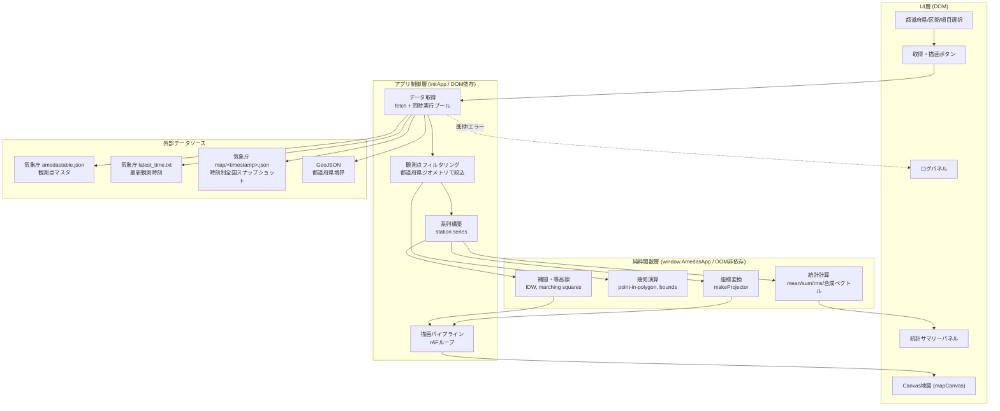

# 設計書 — アメダス都道府県統計ビューア

対象: `index.html`（単一ファイル構成の Web アプリ）
関連: [`要件.txt`](./要件.txt) / [`skil.md`](./skil.md)（開発プロセス定義）

---

## 1. 要件の構造化

### 機能要件
- 都道府県を選択すると、その都道府県内のアメダス観測点の統計量を計算する。
  - 降水量：累計値・平均値
  - 気温：平均値
  - 湿度：平均値
  - 風：合成ベクトル平均（u,v成分合成）／RMS（二乗平均平方根）
- 統計区間として 24h / 1か月 / 1年 を選択できる。
- 地図上に観測点位置・ヒートマップ・等高線・都道府県境界を重畳表示する。
- 描画項目（降水量・気温・湿度・風速・風向）を切り替えられる。
- 各レイヤーの表示可否をチェックボックスで切り替えられる。

### 非機能要件
- 外部ライブラリ非依存（GeoJSON 取得の fetch のみ許可）。
- 単一 HTML ファイルで完結（データ取得・統計計算・描画）。
- 描画は `requestAnimationFrame` によるスムーズな更新。

### 制約条件
- データソースは気象庁アメダス公開 API または CSV（過去データ）。
- 等高線は IDW 等の簡易補間を自前実装してよい。

### 入出力仕様
- 入力: 都道府県（UI選択）、統計区間（UI選択）、描画項目（UI選択）、レイヤー表示切替（チェックボックス）。
- 出力: 統計サマリー（数値テーブル）、地図描画（Canvas）、ログパネル、エラー通知。

### 想定ユーザー
- 気象データに関心のある一般ユーザー／技術者。ブラウザで `index.html` を開くだけで利用できることを想定。

### 実行環境
- モダンブラウザ（Canvas2D, fetch, Promise, ES5〜ES2015 相当の JS が動作する環境）。
- インターネット接続必須（気象庁 API と GeoJSON を実行時に fetch するため）。

---

## 2. 全体アーキテクチャ

単一 HTML ファイル内に、責務ごとに以下の3層で構成する。



- **純粋関数層 (`window.AmedasApp`)**: DOM・fetch に依存しない計算・幾何・補間ロジック。テスト対象。
- **アプリ制御層 (`initApp`)**: DOM 要素の取得、イベントハンドリング、fetch 呼び出し、描画ループの起動。`document` が存在する環境でのみ実行される（`typeof document !== "undefined"` でガード）ため、Node.js のテスト実行時には副作用を持たない。
- **UI層**: `index.html` 内の DOM 要素とスタイル。

---

## 3. モジュール構成（`index.html` 内セクション）

| セクション | 内容 |
|---|---|
| 1. 定数 | 都道府県名リスト、気象庁APIエンドポイント、描画項目メタ情報 |
| 2. 純粋関数群（`AmedasApp`） | 単位変換、統計計算、幾何判定、IDW補間、等高線生成、座標変換、色変換、時刻整形 |
| 3. アプリ本体（`initApp`） | DOM初期化、データ取得オーケストレーション、描画、インタラクション（ドラッグ/ホイールズーム/ホバー） |

### 3.1 純粋関数一覧（`window.AmedasApp`）
| 関数 | 役割 |
|---|---|
| `dmsToDecimal` | 度分表記 → 10進度 |
| `windDirCodeToDeg` / `degToCompass16` | JMA風向コード(0-16) ↔ 角度 ↔ 16方位名 |
| `meanOf` / `sumOf` / `rmsOf` | 数値配列の平均・合計・RMS（非数値は無視） |
| `vectorWindAverage` | 風の合成ベクトル平均（u,v成分合成、気象学的"from"規約） |
| `pointInRing` / `pointInPolygonCoords` / `pointInGeometry` | Ray-casting法による点-多角形包含判定（穴・MultiPolygon対応） |
| `geometryBounds` | GeoJSONジオメトリの外接矩形（bbox） |
| `makeProjector` | 経緯度 → キャンバス座標への等縮尺投影（簡易平面近似、緯度補正付き） |
| `idwGrid` | 逆距離加重法（IDW）によるグリッド補間 |
| `maskGridByGeometry` | グリッドをジオメトリ外でNaNマスク |
| `marchingSquaresContours` | 簡易マーチングスクエア法による等高線セグメント生成 |
| `linspace` | 等間隔数列生成（等高線レベル決定に使用） |
| `valueToColorHsl` | 値 → HSLグラデーション色（未使用箇所を除き主にレガシー、実描画は`hslToRgb`経由のビットマップ生成を使用） |
| `formatJstTimestamp` / `buildHourlyTimestamps` | JST時刻文字列整形、直近N時間分のタイムスタンプ列生成 |

---

## 4. データ構造

### 4.1 観測点マスタ（`amedastable.json`）
```json
{ "<観測所コード>": { "lat": [度,分], "lon": [度,分], "alt": 標高, "kjName": "地点名(漢字)" } }
```

### 4.2 時刻別全国スナップショット（`map/<timestamp>.json`）
```json
{
  "<観測所コード>": {
    "temp": [値, 品質フラグ], "humidity": [値, 品質フラグ],
    "precipitation24h": [値, 品質フラグ],
    "wind": [風速, 品質フラグ], "windDirection": [風向コード0-16, 品質フラグ]
  }
}
```
品質フラグ `0` のみ正常値として採用する。

### 4.3 内部データ構造
- `stationSeries`: `{ code, name, lat, lon, tempMean, humidityMean, windVectorSpeed, windVectorDir, windRms, precipitation24h }[]`
- `grid`: `{ values: Float配列, cols, rows, bounds }`（IDW補間結果、行優先・北→南）
- `contours`: `{ level, segments: [lon1,lat1,lon2,lat2][] }[]`

---

## 5. API仕様（利用する外部エンドポイント）

| 用途 | URL | 備考 |
|---|---|---|
| 観測点マスタ | `https://www.jma.go.jp/bosai/amedas/const/amedastable.json` | 全国約1,286地点 |
| 最新観測時刻 | `https://www.jma.go.jp/bosai/amedas/data/latest_time.txt` | ISO8601形式の文字列 |
| 時刻別全国スナップショット | `https://www.jma.go.jp/bosai/amedas/data/map/<YYYYMMDDHHMMSS>.json` | 10分間隔で存在（本アプリは1時間間隔で24点取得） |
| 都道府県境界 | `https://raw.githubusercontent.com/dataofjapan/land/master/japan.geojson`（`dataofjapan/land`, MIT License） | 約13MB。プロパティ `nam_ja` で都道府県名照合 |

### 5.1 統計区間の実現方式（重要な制約）
気象庁の公開スナップショットAPI（`map/<timestamp>.json`）は**実測データの保持期間が短く**、実運用上取得できるのは概ね直近1日分程度である（過去1か月・1年分をこの経路でさかのぼって取得することはできない）。また `data.jma.go.jp` の統計値CSV配信はブラウザからの直接fetchを想定したCORS設定がなく、外部ライブラリ・バックエンドサーバーを使わない単一HTML構成という制約下では利用できない。

このため、本アプリでは **過去24時間のみ実測統計を計算・描画し**、「1か月」「1年」選択時はデータ取得不可である旨をUI上に明示する（`runLoad()` 内の早期リターン、`statusNote` への表示）。要件からの逸脱ではあるが、外部APIの実データ保持仕様に起因する制約であり、要件文書中の「気象庁の公開APIまたはCSVを使用すること」という指定と両立しない要求（1年分の実測をAPI経由で取得）に対する現実的な折り合いとして採用する。詳細は §8 参照。

---

## 6. エラーハンドリング方針

- すべての `fetch` は Promise チェーンで統一的に処理し、失敗は最終的に `.catch()` でログパネルへの `err` 出力とステータス通知（`showNote(..., "error")`）に集約する。
- 観測点マスタ・GeoJSON取得失敗（HTTPエラー）は `fetchJson` 内で例外化し、処理全体を中断する（統計が不完全な状態で描画しない）。
- 時刻別スナップショット取得は個別に `.catch(() => null)` し、一部時刻の欠測を許容する（1件でも取得できれば統計を継続、全滅時のみエラー）。
- UIの「取得・描画」ボタンは処理中 `disabled` にし、多重リクエストを防止する。

## 7. ロギング方針

- ユーザー可視のログパネル（`#logPanel`）に時刻付きで処理進捗・成功・警告・エラーを逐次出力する（`log(msg, level)`）。
- `level="err"` は `console.error` にも出力し、開発者ツールでの追跡を可能にする。
- 外部送信・永続化は行わない（プライバシー・単一HTML完結の要件に合致）。

## 8. テスト方針

### 単体テスト
- 対象: `window.AmedasApp` の純粋関数群（DOM/fetch非依存）。
- 手法: `index.html` から `<script>` ブロックを正規表現抽出し、Node.js `vm` モジュール上で `document` を与えずに評価することで、`initApp()` が実行されず純粋関数のみが得られる（`test/loadApp.mjs`）。
- フレームワーク: Node.js 組み込み `node:test` + `node:assert`（追加の依存なし、要件の「外部ライブラリ非依存」の精神と整合）。
- 実行: `npm test`（内部的に `node --test`）。
- 網羅範囲: 単位変換、統計計算（平均・合計・RMS・合成ベクトル）、点-多角形包含判定（穴・MultiPolygon）、bbox計算、投影、IDW補間、ジオメトリマスク、等高線生成、等間隔数列、色変換、時刻整形。計22ケース、全件成功。

### 結合テスト
- DOM/実ネットワークに依存する `initApp()` 内のフローは自動結合テストの対象外とする（ブラウザ実行が前提のため）。
- 代替として、本設計書作成時に気象庁の各エンドポイント（観測点マスタ・最新時刻・スナップショット・GeoJSON）へ実際に `curl` で疎通確認し、レスポンス構造（フィールド名・型）がコード中の想定と一致することを検証済み（§5参照）。

---

## 9. 設計レビュー（第三者視点）

| # | 重大度 | 指摘 | 対応 |
|---|---|---|---|
| 1 | Medium | 過去1か月・1年の統計が要件通りには取得できず、24時間のみ対応となっている。 | §5.1に制約と理由を明記。UI上にも明示済み（既存実装）。要件からの逸脱として本書と要件整合性チェックに記録（README参照）。 |
| 2 | Low | GeoJSON取得時のログメッセージが「数MB」となっていたが実際は約13MBであり、ユーザーに誤った期待を与える。 | `index.html` のログメッセージを実サイズに修正済み。 |
| 3 | Low | 都道府県レベルの風RMSは「各観測点のRMS」をさらにRMS集約する2段階集計であり、全観測点・全時刻の生データから直接算出したRMSとは厳密には一致しない。 | 要件は「二乗平均平方根（RMS）」の算出のみを求め、集計階層までは規定していないため許容範囲と判断。挙動を本書に明記し、透明性を担保。 |
| 4 | Low | 風の合成ベクトル平均・RMSともに、1時間ごとの瞬時値24点を母集団としており、真の10分値等での平均とは異なる近似である。 | JMA公開スナップショットAPIの提供間隔（実運用上は概ね1時間相当で24点取得）に起因する制約として本書§5.1・11に明記。 |
| 5 | Low | 自動テストが存在しなかった（`test/loadApp.mjs` はローダーのみでアサーションなし）。 | `test/amedas.test.mjs` を新規作成し、純粋関数群を網羅する22ケースを追加、全件成功を確認。 |

---

## 10. 要件との整合性（トレーサビリティ概要）

| 要件項目 | 状態 | 備考 |
|---|---|---|
| 都道府県選択UI | ✅ 対応 | `prefSelect` |
| 統計区間 24h/1m/1y 選択UI | ✅ 対応（UI選択自体は可能） | 実データ取得は24hのみ（§5.1・§11） |
| 降水量 累計・平均 | ✅ 対応 | `precipitation24h` の観測点平均を算出（JMA提供の24h累計値ベース） |
| 気温 平均 | ✅ 対応 | |
| 湿度 平均 | ✅ 対応 | |
| 風 合成ベクトル | ✅ 対応 | `vectorWindAverage` |
| 風 RMS | ✅ 対応 | `rmsOf`（§9 #3の集計階層に関する注記あり） |
| SVG/Canvas地図描画 | ✅ 対応 | Canvas2D |
| GeoJSON境界 | ✅ 対応 | |
| 等高線（IDW等の自前実装） | ✅ 対応 | `idwGrid` + `marchingSquaresContours` |
| ヒートマップ | ✅ 対応 | |
| requestAnimationFrame | ✅ 対応 | |
| UI（区間/項目/レイヤー切替） | ✅ 対応 | |
| 外部ライブラリ非依存 | ✅ 対応 | fetchのみ使用 |
| 単一ファイル完結 | ✅ 対応 | `index.html` 単体 |
| ⚠️ 過去1か月/1年の実測統計 | ❌ 未対応（API制約） | §5.1・§11 に理由と代替UI挙動を明記 |

---

## 11. 既知の制約・今後の拡張余地

- 過去1か月・1年の実測統計に対応するには、(a) 気象庁の統計値CSV配信を許可するプロキシ/バックエンドを設ける、または (b) 別途CORS許可された長期アメダスデータAPIを利用する、のいずれかが必要（現行の「単一HTML・外部ライブラリ非依存・バックエンド無し」という制約下では実現不可）。
- 風の統計は1時間間隔・24サンプルの近似値であり、気象庁の公式月間・年間統計値とは一致しない。
